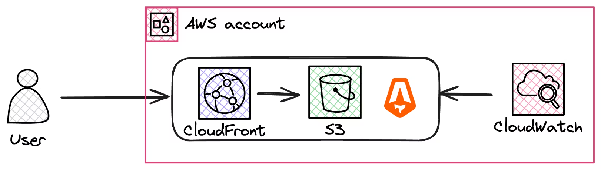

# CloudWatch Synthetic Canaries with SST Ion

This repository provides a hands-on guide to deploying a web application using SST Ion and monitoring it using AWS CloudWatch Synthetic Canaries. The project aims to demonstrate how to use AWS services for effective monitoring and visual regression testing.



## Prerequisites

Before you begin, ensure you have the following:
- An AWS account
- Node.js installed

## Installation

Follow these steps to get your application up and running:

1. **Clone the Repository**
   ```bash
   git clone https://github.com/awsfundamentals-hq/cloudwatch-synthetics-visual-regression-tests
   cd cloudwatch-synthetics-visual-regression-tests
   ```

2. **Install SST Ion**
   SST Ion can be installed using a script or via a package manager. Choose the method that best fits your setup:

   - **Using the Install Script**
     ```bash
     curl -fsSL https://ion.sst.dev/install | bash
     ```

   - **Using Homebrew**
     ```bash
     brew install sst/tap/sst
     brew upgrade sst
     ```

3. **Install Dependencies**
   ```bash
   npm install
   ```

4. **Deploy the Application**
   ```bash
   sst deploy
   ```

You can also execute the following command to run the development mode:
```bash
npm run dev
```

## Usage

Once deployed, the application will be monitored using AWS CloudWatch Synthetic Canaries. You can view the monitoring results in your AWS console under CloudWatch > Synthetic Canaries.

## Contributing

We welcome contributions! Please feel free to fork the repository and submit pull requests. You can also open issues to discuss potential changes or report bugs.

## License

This project is open source and available under the [MIT License](LICENSE).